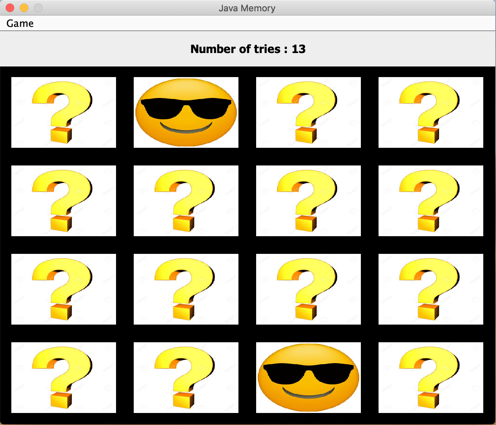

= JMemory

This memory game was developed in Java with the IDE Eclipce.

== How to run the application?

* In the IDE: find `Main.java`, right-click project, select "Run As > Java Application"
* From the command line: run `java -jar jMemory.jar`

